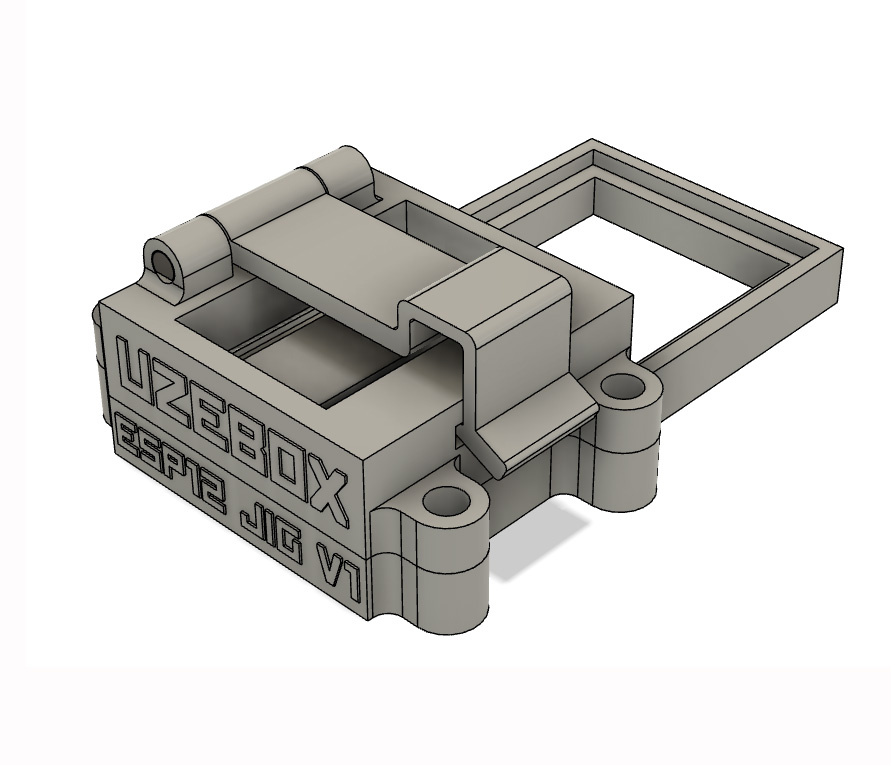
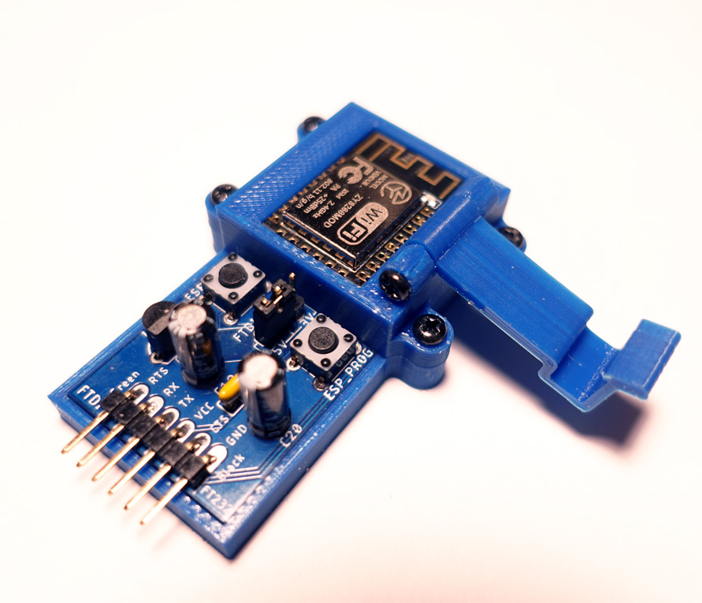
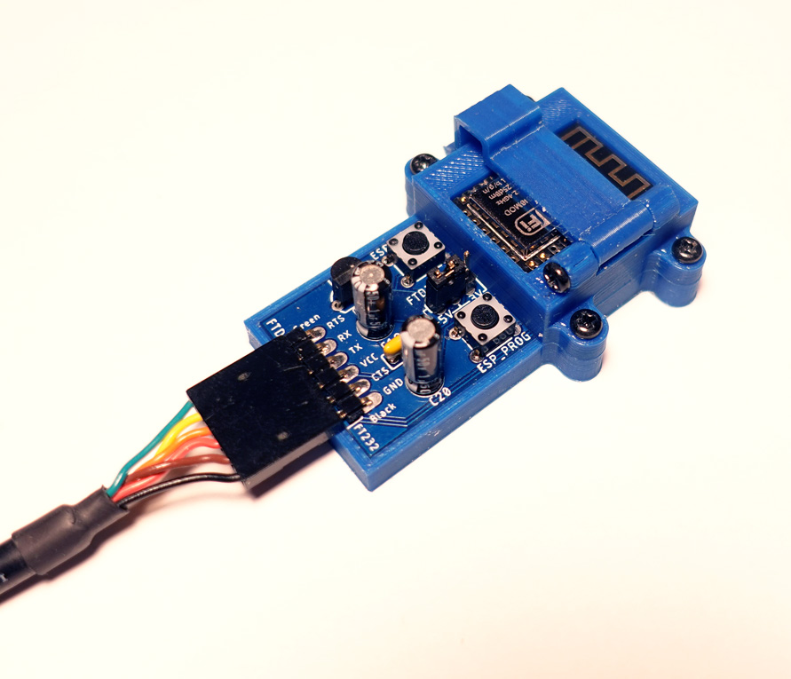

3D CAD models for version 1.2 of the ESP-12F programming jig. This jig allows to program ESP-12E or ESP-12F modules based on the the Espressif ESP8266 Wifi modules in a non-destructive manner. That is, along through hole pins, it can be fitted with pogo pins. 

  

### Notes
* Models provided in .3MF and Autodesk Fusion360 zipped project format. 
* Requires 4 screws: M2.6 x 10mm
* Latch pin can be 3d printed (model included)
* The latch must be [printed on the Z axis for strength](https://github.com/Uzebox/uzebox/blob/master/cad/Enclosures/ESP-12F-Programming-Jig/V1.2/assets/3dprint.jpg)

### Compatible with the folowing schematic and PCB
* [ESP-12 jig PCB](https://github.com/Uzebox/uzebox/tree/master/schematics/ESP-12F-Programming-Jig/V2.1)

