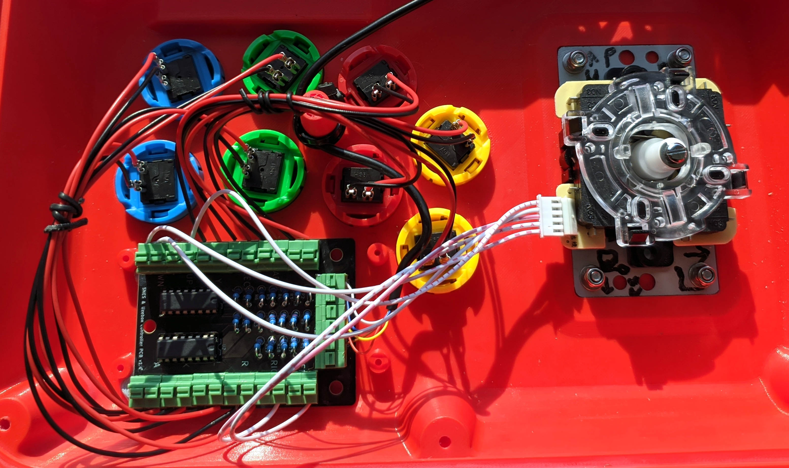
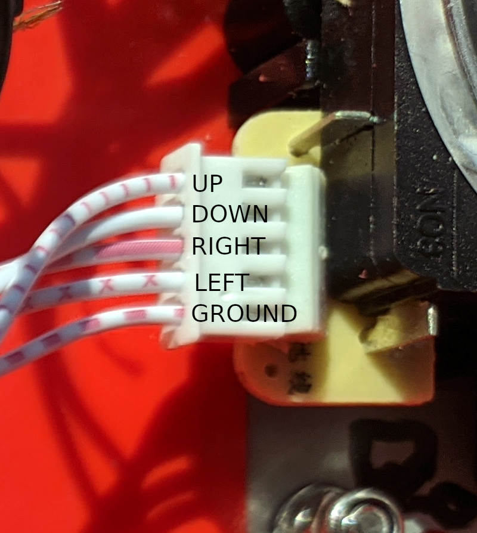

# Uzebox Fightstick joystick enclosure

This directory contains the **.stl** files for you to print an enclosure to house a Sanwa compatible joystick and 8x 30 mm diameter buttons. It includes three supports on the inside of the upper case for mounting the [Uzebox joystick controller PCB](https://github.com/Uzebox/uzebox/tree/master/schematics/Joystick/V1.5).

Also included are the Fusion 360 **.f3z** and **.step** files for those who wish to modify the design.

This joystick enclosure was designed by Jason Znack who kindly offered to customize his [Fightstick](https://www.thingiverse.com/thing:5132706) to better house the Uzebox joystick controller PCB when I asked if we could include his design in the Uzebox repo. Thanks Jason!

## Printing

Your 3D printer must be capable of printing at least 300 mm wide x 50 mm tall x 205 mm deep to print the Fightstick.

When you are 3D printing large items such as this case, it is common for a thin but till quite obvious seam to be printed that is quite clearly visible along the full height of the object if you just use the default print settings of your 3D printing software. Check the documentation of your 3D printing software to find if it has a feature called **Z seam randomization (or randomisation)**. If so, you should enable this when printing the upper case to try to avoid having a visible seam.

If you are using PLA filament to print, it could well take you 24 hours or longer just to print the upper case and another 6 or so for the lower part, if you only have one 3D printer.

## Bill of Materials

The main components required to build this joystick are a Sanwa compatible joystick and 8x 30 mm diameter buttons and the wires to connect the joystick and every button to the controller PCB. All three of these can be [bought together in kit for less than $10](https://vi.aliexpress.com/item/1005007982022398.html).

You will also need:

1 x [SNES controller extension cable](https://www.aliexpress.com/item/4000023893179.html) strip one end of the cable to connect the controller PCB.

4 x [M4 12 mm nuts with locking nuts](https://www.aliexpress.com/item/1005007813468077.html) to attach the joystick's base plate.

3 x M3 6 mm self tapping screws to mount the PCB.

7 x 25 mm flat head screws.

## How do I wire it up?

See the [Uzebox joystick wiki page](https://uzebox.org/wiki/Joystick) for more info, build tips and alternative cases etc.

# License

This joystick enclosure is licensed under the [Creative Commons - Attribution](https://creativecommons.org/licenses/by/4.0/) license.
