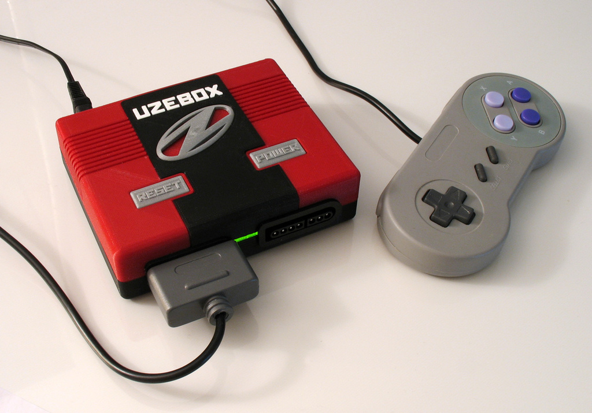
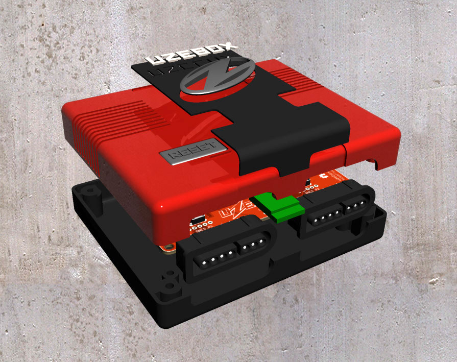
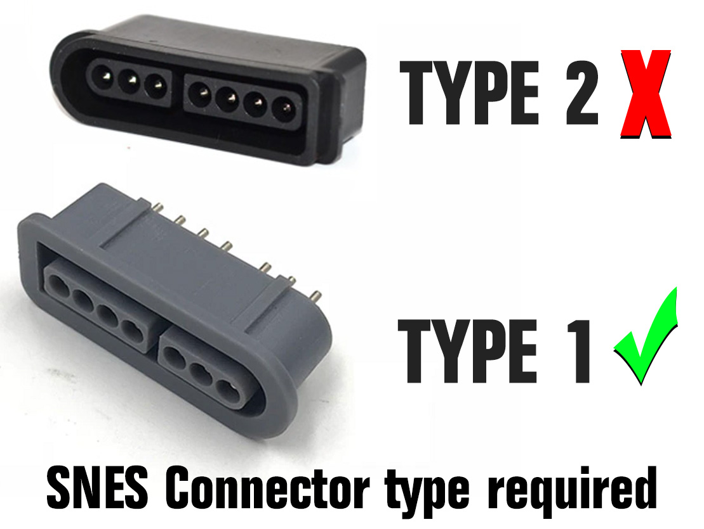
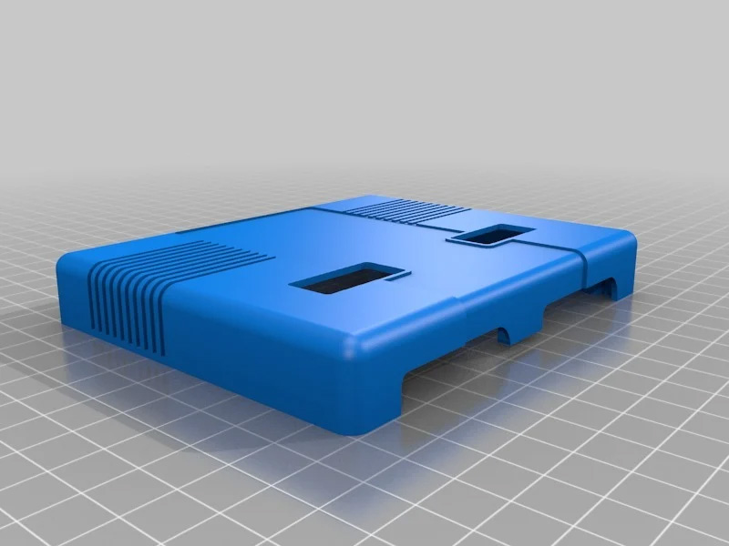
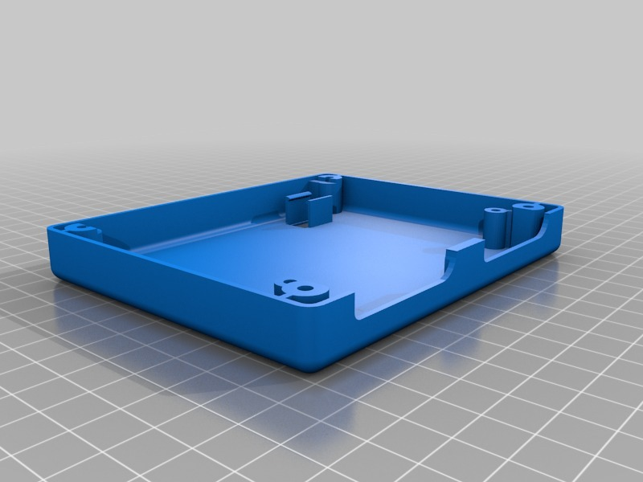
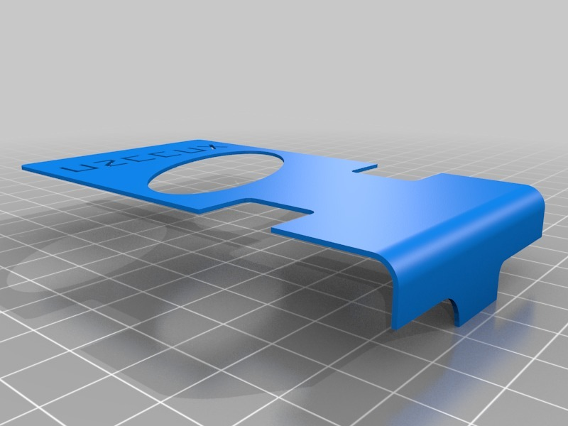
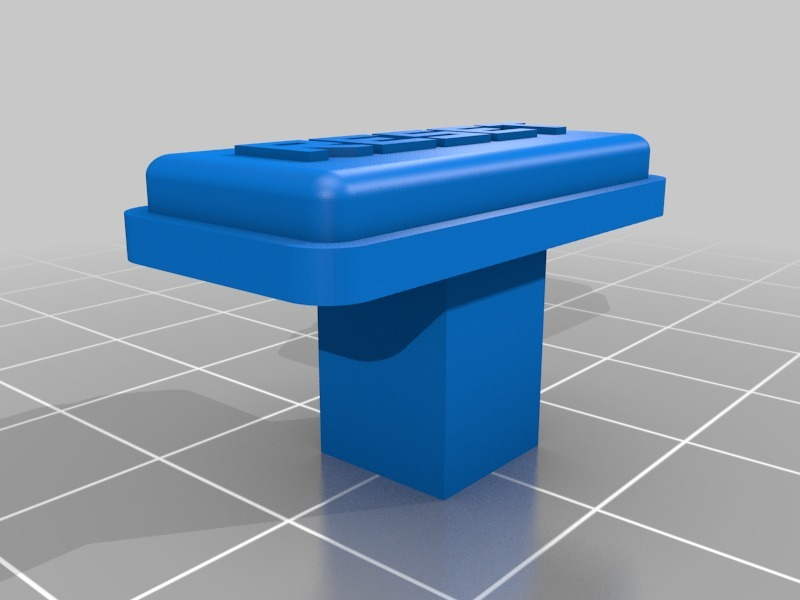
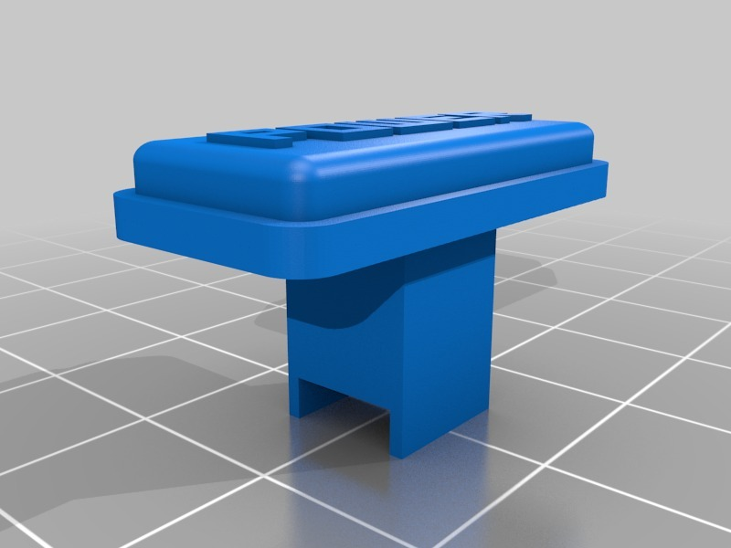
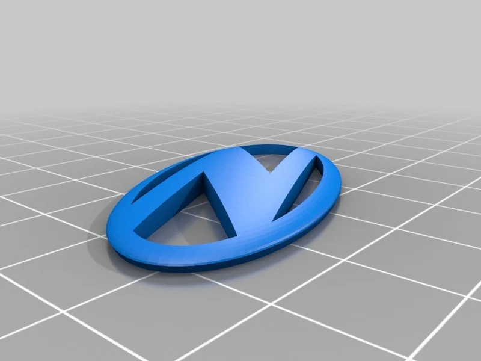
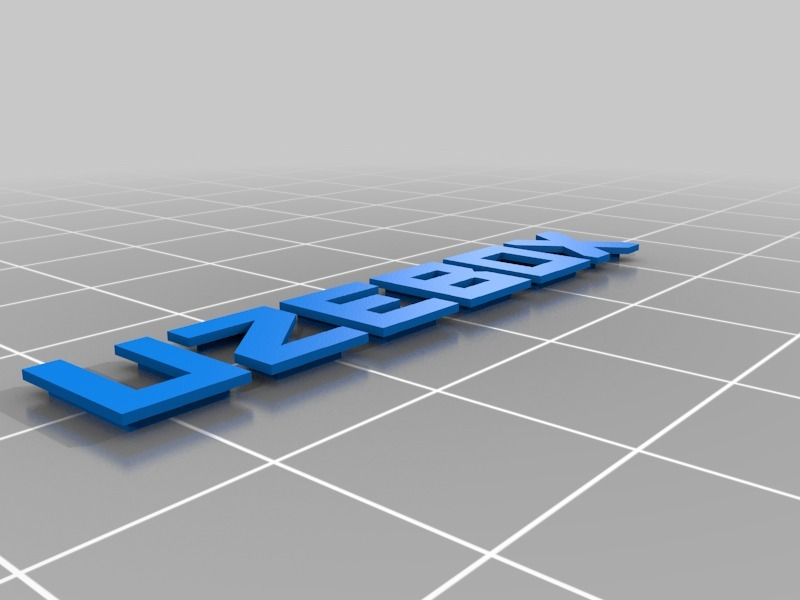

3D CAD models for version 1 of the Uzebox enclosure fitted with type 1 SNES connectors.

  

     

### Notes
* Models provided in .STL format only
* Tips and tricks on 3D printing and modifications to the case can be found on the [Uzebox WIKI](https://uzebox.org/wiki/3D_printed_case).

### Compatible with the folowing Uzebox PCB designs
* [Uzebox (All revisions)](https://github.com/Uzebox/uzebox/tree/MoveEagleAndCADtoGit/schematics/Uzebox/V5.0)
