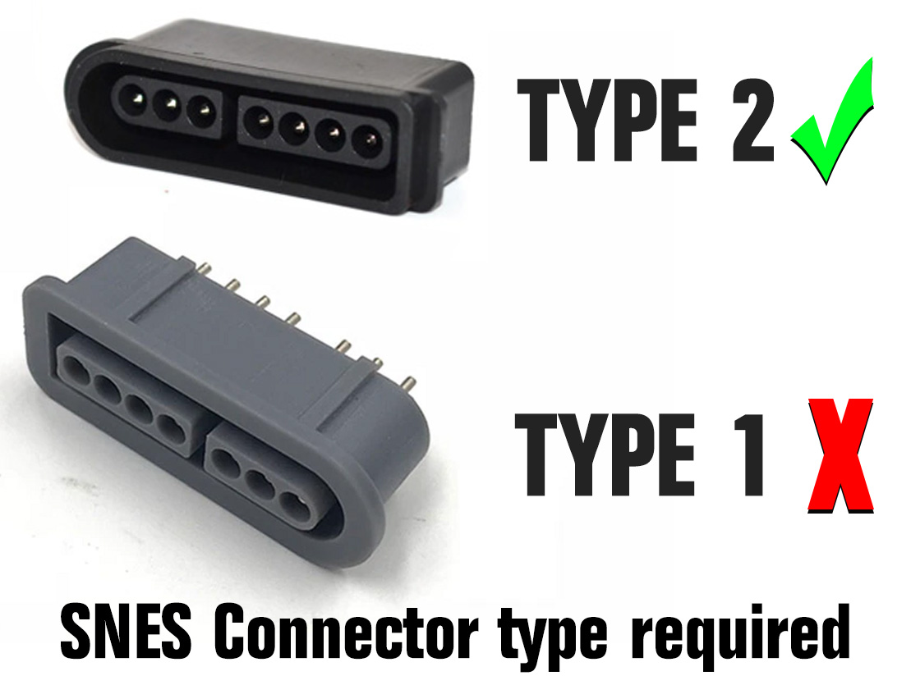

3D CAD models for version 2 of the Uzebox enclosure fitted with type 2 SNES connectors.

 

### Notes
* Version 2.0 has a cutaway at the back of the top shell to allow the use of right-angled ISP sockets.
* Models provided in .3MF and Autodesk Fusion360 zipped project format. 
* Tips and tricks on 3D printing and modifications to the case can be found on the [Uzebox WIKI](https://uzebox.org/wiki/3D_printed_case).

### Compatible with the folowing Uzebox versions
* [Uzebox (All revisions)](https://github.com/Uzebox/uzebox/tree/MoveEagleAndCADtoGit/schematics/Uzebox/V5.0)
* Uzebox Omega

