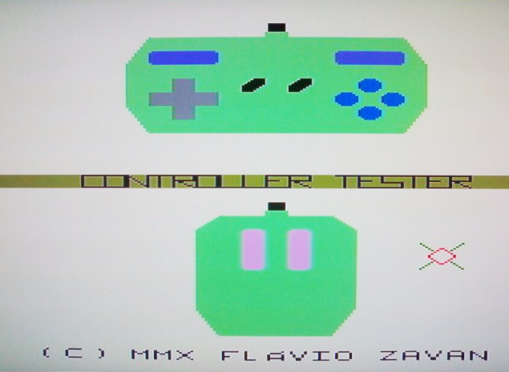

# Controller Tester
This tool help test the controllers connected to the gamepad ports.

 
## Features

* Hot-plug detection
* Detects gamepads and the Nintendo SNES mouse

## Links

* More details and pre-compiled ROMs and  can be found in the project's [WIKI page](https://uzebox.org/wiki/Controller_Tester).
