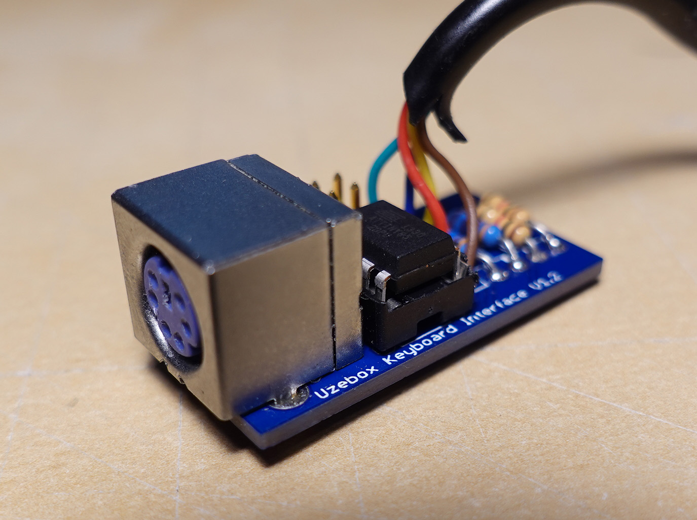

# Uzebox Keyboard Interface Firmware V1.01

Firmware for the [Uzebox Keybord Interface](/schematics/Keyboard-Interface/V1.2) that allows the Uzebox to communicate with a standard PS/2 keyboard. 

 

## Notes
* This firmware supports the ATtiny45/85
* Pre-compiled binary for the ATtiny85 included
* Support sending host commands to the keyboard in order to support keyboard that requires the host to send any command right after a reset/BAT. Otherwise the keyboard re-enters BAT (self-test) endlessly sending 0xAA on the bus. This allows the support of PS/2 Perixx keyboards.
* Implements the Uzebus protocol
* Run AvrBuild.bat to compile (Requires an installation of Microchip Studio to build the assembly file)

##To Do
* Port to GNU Assembler and create Makefile

