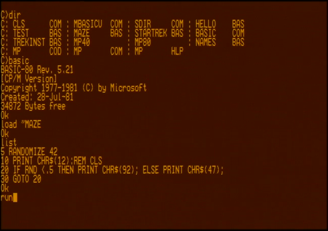
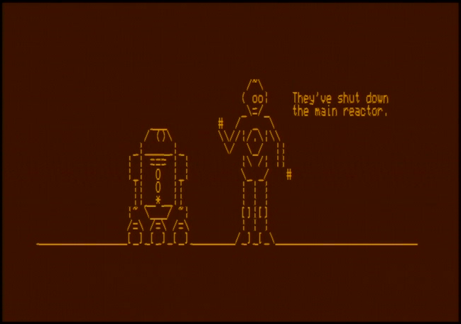
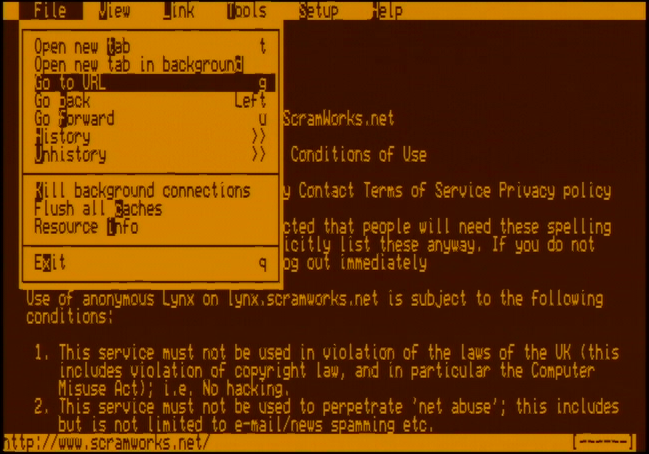
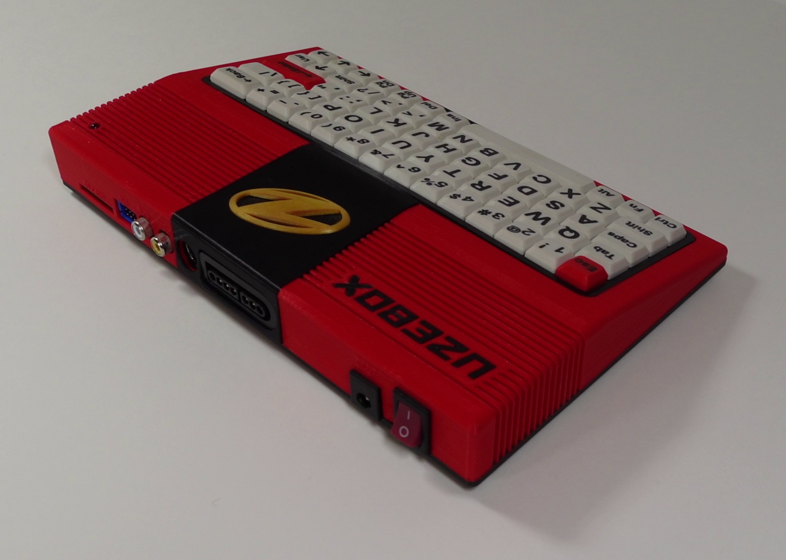

 &nbsp; &nbsp; &nbsp; &nbsp; &nbsp;
# Description
The Uzebox PC project goal is to emulates as much as possible of an 8-bit CP/M computer directly from an AVR 8-bit microcontroller running at 28Mhz.  

Specifications:
 * Intel 8080 CPU emulator handwritten in assembler
 * NTSC 80x25 characters display with regular and inverse video
 * 64K memory support using the SPI RAM 
 * 4 x 8" 160Kb disk drive emulation
 * Uzenet network connectivity support (ESP8266 WIFI module + SPI RAM)
 * Uzebox keyboard interface support
 * VT100 Terminal emulation
 * Native AVR Telnet client for speed
 * Runs native CP/M 2.2 binaries at a speed roughly equivalent to an 1 Mhz Altair 8080 
 * Custom 3D printed enclosure with dedicated keyboard PCB

# 8080 Emulator
At the core is a intel 8080 CPU emulator implemented in AVR assembler for speed. The emulator uses the SD card interface for disk drive emulation and the SPI RAM for the 64K system RAM. Although random RAM access can take up to 64 clock cycles, emulation speed is still roughly equivalent to a 1Mhz Altair 8800 machine.

# Disk images
The emulator emulates up to 4 disk drives using disk image files. The images format are 100% compatible with the original 8" CP/M disk formatting. Disk images can be created and mofified to add and remove files using tool like the [cpmfs](http://www.sydneysmith.com/wordpress/cpmfs/) utility under /tools/cpmfs.

A collection of pre-built disk images are provided under /data/diskimg.  

# Building and running the project
The project's Makefile is located in the /default build folder. Once built the binary can run on any Uzebox revision equiped with the Uzenet interface. In order to fully run the projet on an emulator (including keyboard and esp8266 support) you will need Lee Weber's Cuzebox fork. Four disk images files along the configuration file are provided for convenience in the build directory. If using Uzebox hardware, copy these five files to your SD card.