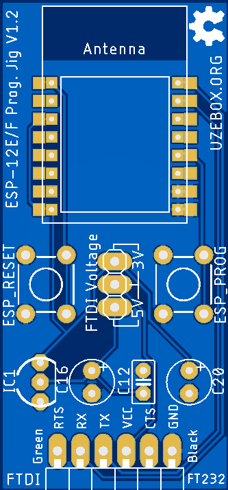
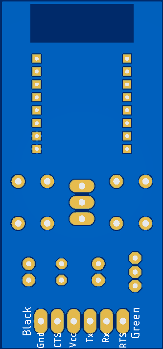

# ESP-12E/F Programming Jig V1.2 

A jig to program the ESP-12E/F modules based on Espressif's ESP8266 Wi-fi module. Specficially made for FTDI TTL-232R cables.

  

### Features
* Dual voltage support for the TTL-232R-3V3 (3.3V I/O) and TTL-232R-5V (5V I/O) cables
* Can use pogo pins or headers as mating options
* Programming switches
* Most discretes parts can be ommited if only 3.3V is to be supported

### Notes
* See the the [Uzebox WIKI](https://uzebox.org/wiki/ESP8266_Manual_Upgrade) on the software and procedure required to upgrade the ESP8266 firmware.
* A 3D printed enclosure is available [here](https://github.com/Uzebox/uzebox/tree/master/cad/Enclosures/ESP-12F-Programming-Jig/V1.2).
* Schematic and PCB design files are provided in EAGLE format (.sch, .brd)
* The provided Gerber files can simply be zipped toghether and directly uploaded to PCB manufacturer such as [JLCPCB](https://jlcpcb.com/) and [PCBWay](https://www.pcbway.com/).

### Revisions 
#### V1.2 - Feb-2023
* Replaced tactile switches with through hole versions
* Added color legend on how to connect the FTDI cable correctly

