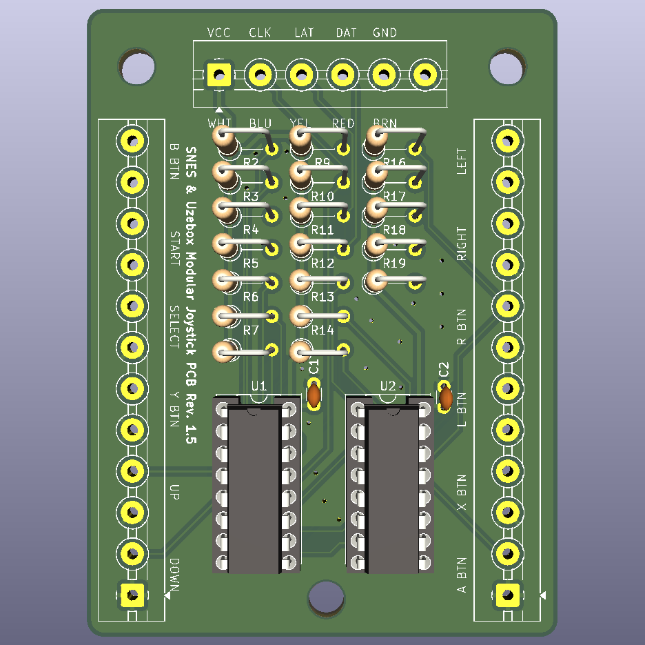

# Uzebox & SNES Modular Joystick PCB

This dual layer, 57mm x 76mm modular joystick PCB was created using [KiCAD](https://www.kicad.org/) by [Uzebox forum](https://uzebox.org/forums/index.php) member altella with help from [taylor-madeak](https://github.com/taylor-madeak) and [danboid](https://github.com/danboid).

See the [Uzebox Joystick wiki page](https://uzebox.org/wiki/Joystick) for more info on how to use this PCB.

## Project Goals

1. Provide a beginner-friendly circuit board design by using all off-the-shelf through-hole components and screw terminals for the button interfaces.
1. Maintain compatibility with both the Uzebox console and its variants as well as all variants (including PAL region consoles) of the original Nintendo Super Famicom/Super NES console.

## Legal Disclaimers

1. This project is in no way affiliated with, licensed by, or endorsed by **Nintendo Co., Ltd.** or their respected partners and subsidiaries.  The names **"Nintendo," "Super Nintendo Entertainment System," and "Super Famicom"** are all registered trademarks of Nintendo Co., Ltd. and are used here for context reference only.
1. This project is offered without warranty of any kind, and the authors **ASSUME NO LIABILITY** for material, physical, or immaterial damages caused by the use or non-use of this design.
