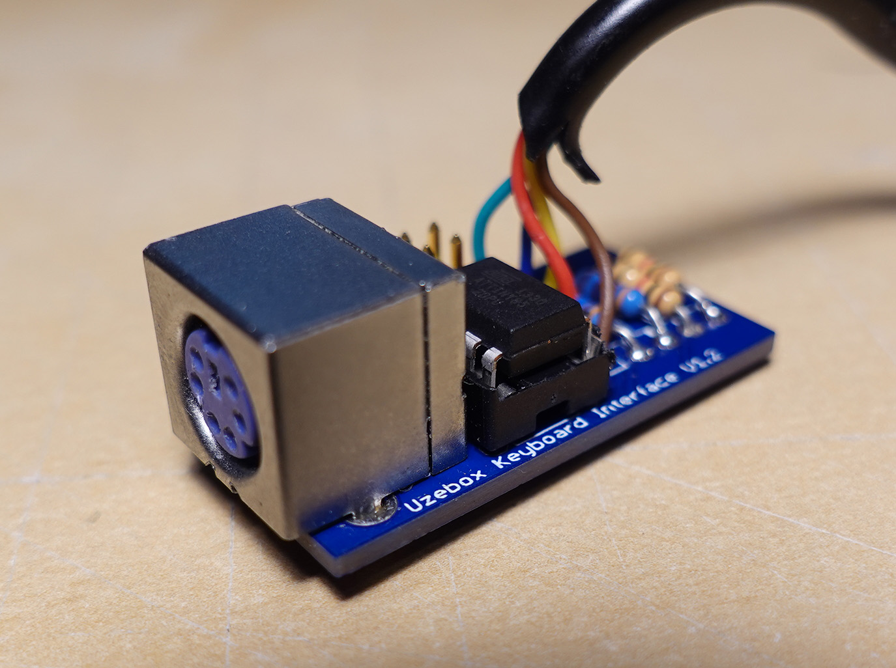
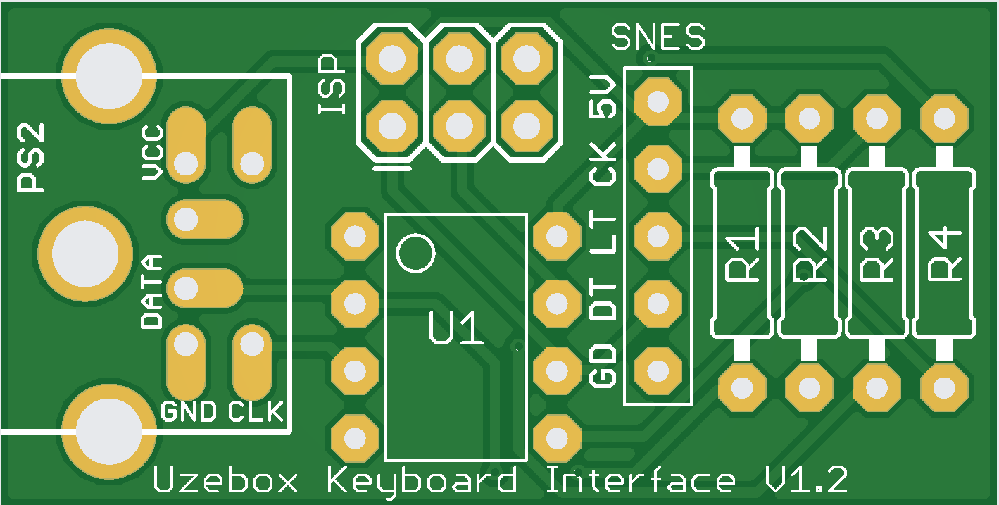
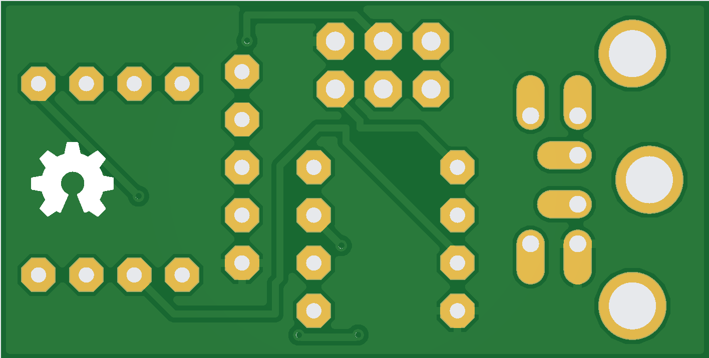

# Uzebox Keyboard Interface V1.2 

The keyboard interface allows the Uzebox to communicate with a standard PS/2 keyboard.

  

See https://uzebox.org/wiki/Uzebox_Keyboard_Interface for more details on the implementation of the interface and the assembly guide.
### Features
* Based on the Atmel ATtiny85/45/25 8-pin DIP
* PS/2 Interface to keyboard 
* Communicates with the Uzebox via a controller port
* Supports bi-directionnal communication
* ISP port to allow reprogramming of the firmware
* Implements the Uzebus protocol

### Notes
* keyboard-adapter-firmware-v2.hex is the latest firmware to be flashed on the ATtiny85. The firmware is built by the [KeyboardFirmware project](/demos/KeyboardFirmware).
* Schematic and PCB design files are provided in EAGLE format (.sch, .brd)
* The provided Gerber files can simply be zipped toghether and directly uploaded to PCB manufacturer such as [JLCPCB](https://jlcpcb.com/) and [PCBWay](https://www.pcbway.com/).

### Revisions 
#### V1.2 - Feb-2023
* Corrected layout issue: Ajusted PCB layout so the ISP progammer's 6 pins header could fit.
* Added pullups on the PS/2 lines since the internal AVR pullups would not work when the tiny85 wanted to send commands to the keyboard.
* Added series resistors on the SNES lines to avoid interfering with ISP programming. Added for development and firmware updates.
* Revamped the PCB design and labeled all components
* Support sending host commands to the keyboard. Implemented to support keyboard that requires the host to send any command right after a reset/BAT. Otherwise the keyboard re-enters BAT (self-test) endlessly sending 0xAA on the bus. This allows the support of PS/2 Perixx keyboards.
