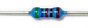
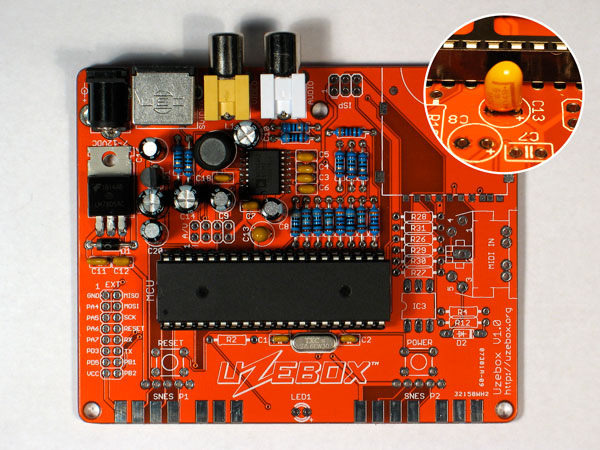

# Uzebox Kit Assembly Guide
For Uzebox Revision V5.0 (aka F5)

> [!NOTE]  
> This assembly guide was made for the commercial Uzebox kit. Some points may not apply if you are building the Uzebox from scratch. Look for notes such as this one along the guide for additionnal instructions.

## Revision History
| Version | Date | Author | Description |
| :---- | :---- | :---- | :---- |
| 0 | 01-Nov-2012 | A.Bourque | Initial release |
| 1 | 6-Nov-2012 | A.Bourque | Minor corrections |
| 2 | 28-Jan-2014 | A.Bourque | Minor changes |
| 3 | 27-Jan-2015 | A.Bourque | Added replacement parts for EXT header and SD card socket |
| 4 | 21-Feb-2015 | A.Bourque | Added preliminary troubleshooting section |
| 5 | 26-Nov-2015 | A.Bourque | Minor improvements |
| 6 | 1-Feb-2016 | A.Bourque | Added note regarding power button |
| 7 | 15-Nov-2016 | A.Bourque | Added notes for PCB rev 1.3.1 and references to the Uzenet interface. |
| 8 | 13-Aug-2024 | A.Bourque | Ported the assembly guide to GitHub and added minor improvements. |
| 9 | 28-Aug-2024 | D.MacDonald | Several additions and improvements. |
| 10 | 17-Sep-2024 | D.MacDonald | Add solder flux, a video cable and a SNES controller to the "Other parts required" table. |

## Parts list verification
> [!IMPORTANT]  
> Ensure you have all the required parts before starting, 

<!--
> [!TIP] 
> Click on the images for a bigger view.
-->
| Component Image | Schematic Reference | Description |
| ----- | ----- | ----- |
|  | N/A 		 | Uzebox printed circuit board (PCB) with pre-soldered AD725 chip.    <b>NOTE:</b> This tutorial was made using PCB rev 1.0. Later revisions may have a slightly different arrangement, but part references will stay the same. For example PCB v1.3.1+ reorganized the SD card voltage divider resistors in order to accommodate the [Uzenet interface](https://uzebox.org/wiki/ESP8266). Relevant differences will be described in the assembly  steps. 		 |
|  | U5 		 | DC power jack 		 |
|  | VIDEO 		 | Composite video RCA jack (Yellow) 			 		 |
|  | AUDIO 		 | Audio output RCA jack (Red or white) 		 |
|  | SVIDEO 		 | S-VIDEO output jack 			 		 |
|  | ISP 		 | Atmega644 programming port 					 		 |
|  | EXT 		 | Extension port header 		 |
|   | N/A 	 | DIP-40 socket for the Atmega644 							 |
|   | POWER / RESET  | Tactile 	switches (x2) 				 |
|   | SD/MMC 		 | Secure Digital memory card socket. One of the two possible models has a soldering wing on the right side only.						 		 |
|   | SNESP1 SNESP2 	 		 | SNES gamepad connectors (x2)			 		 |
|   | C1,C2,C18 		 | 18pF ceramic capacitors		 		 |
|   | C3,C4,C5, C6,C7,C12 	 | .10uF (100nF) ceramic capacitors 	 |
|   | C11 | .33uF (330nF) ceramic capacitor 	 |
|   | C13  | 10uF tantalum capacitor	 |
|   | C16,C20  | 1uf electrolytic capacitors 			 		 |
|   | C8,C9 | 10uF electrolytic capacitors 			 |
|   | C10,C14, C15  | 220uF 	electrolytic capacitors 		 |
|  | R7,R11, R19,R20, R24,R25  | Resistor 75Ω 1% (Violet, green, black, gold, brown)	 |
|   | R2,R26, R27,R28  | Resistor 301Ω 1% (Orange, black, brown, black, brown) 		 |
|   | R29,R30, R31 | Resistor 562Ω 1% (Green, blue, red, black, brown) 	 |
|   | R3,R6,R10,R18 		 | Resistor 806Ω 1% (Gray, black, blue, black, brown)	 |
|   | R5,R9,R17	 | Resistor 1.58KΩ 1% (Brown, green, gray, brown, brown)  |
|   | R1,R8,R22	 | Resistor 3.16KΩ 1% (Orange, brown, blue, brown, brown) 	 |
|   | MCU 	 | ATmega644 microcontroller 			 		 |
|   | XTAL | 28.63636Mhz crystal  |
|   | L1 		 | 68uH inductor 			 		 |
|   | IC1 	 | 3.3V voltage regulator  |
|   | IC2 	 | 5.0V voltage regulator 		 |
|   | D1  | Rectifier diode 			 |
|   | LED1	 | Power	LED  |
|   | N/A 	 | Bumpons  |

## Tools required

To assemble this kit you will need the following tools:

| Tool | Description |
| :---: | ----- |
|  | A basic soldering iron, 25W-40W. |
|   | Solder, rosin core, 60/40 type. |
|   | Long nose pliers. |
|   | Regular cutters will do fine, but shear cutters will do a better job. |
|   | A basic multimeter is not essential but highly recommended for verifications and troubleshooting. |
|   | An AVR ISP programmer. Required to flash the Atmega644 if you are building the Uzebox from scratch. See [this section](#recommended-avr-isp-programmers) for a list of recommended AVR ISP programmers. Alternately, you can flash the Atmega using [avrdude](https://uzebox.org/wiki/Avrdude) and the GPIO header of a Raspberry Pi or similar.|

## Other parts required

| Part | Description |
| :---: | ----- |
|   | A standard 7-12VDC power supply with a center-positive, 5.5x2.1mm tip. |
|   | A Composite or S-Video cable. |
|   | A [SNES controller.](https://uzebox.org/wiki/FAQ#Where_can_I_buy_Uzebox_compatible_controllers?) |
|   | Solder flux. Not needed but makes it much easier to solder the SNES connectors, SD card socket and the AD725.|

## Soldering the AD725 chip

The trickiest part of building a Uzebox is soldering the AD725 video conversion chip. If you're new to SMD/SMT soldering, you can refer to [this video](https://www.youtube.com/watch?v=S7GWMNdyopo) which demonstrates how to solder the AD725.

## Building the kit
### Assembling the power supply section

<table>
    <tr>
        <td width="50%"></td>
        <td>Using pliers, bend the pins of <b>IC2</b>, the 5V voltage regulator, at a 90 degrees angle as pictured.</td>
    </tr>
    <tr>
        <td></td>
        <td>Mount <b>IC2</b> on the PCB along diode <b>D1</b>. Notice the diode has a white stripe on one end to indicate the direction of current. Ensure the band matches with the component’s drawing on the PCB. As with all future components you will solder, when inserting a component, bend its pins on the other side of the PCB so it holds in place.  Flip the PCB and solder all pins.</td>
    </tr>
    <tr>
        <td></td>
        <td>Using the cutters, cut the pins excess wire. Watch out that those flying wire bits don't end up in your eyes!</td>
    </tr>
    <tr>
        <td></td>
        <td>Insert <b>U5</b>, the DC barrel jack. Bend the pins on the soldering side to keep it held firmly in place. To ensure it's soldered flat, you can also put the 40 pin DIP socket underneath the PCB to level it up. Be sure to put plenty of solder on the three pins so that the jack is securely mounted.</td>
    </tr>
    <tr>
        <td></td>
        <td>Add <b>C11</b> (.33uF), <b>C12</b> (100nF), <b>C16</b> (1uF), <b>C20</b> (1uF) and <b>IC1</b> (3.3v regulator).  The electrolytic capacitors (the black cans) have a polarity. The negative pin is marked with a white stripe and little minus signs on the side. Ensure the opposite pin (the longest one) inserts in the hole which has a little "+" next to it.  Solder all pins and remove excess wire. That completes the power supply section.</td>
    </tr>
    <tr>
        <td></td>
        <td>If you have a multimeter, let’s test what we have so far. Switch your multimeter to DC voltage measurement mode. Plug in the power supply and probe pin 1 and 7 on the P1 SNES connector footprint. If all goes well, you should measure around 5V. Unplug the power.</td>
    </tr>
</table>

### Assembling the microcontroller and sound section

<table>
    <tr>
        <td width="50%"></td>
        <td>Add the DIP-40 socket and ensure the DIP socket notch is located to the left. Add <b>XTAL</b> (crystal), <b>C1</b> and <b>C2</b> (18pF), <b>R3</b> (806Ω), <b>R22</b> (3.16KΩ) and <b>AUDIO</b> jack (white or red). Pre-bend the resistors using the pliers to ensure they all look nicely aligned on the PCB. </td>
    </tr>
    <tr>
        <td></td>
        <td>Insert <b>MCU</b> (ATmega644) into the DIP-40 socket. Notice one end of the chip has a notch, it goes the same way as the socket.  Plug in a RCA cable to your TV's audio input and plug the power supply. If all goes well, you should hear the Uzebox logo bell sound! Give yourself a pat on the back! </td>
    </tr>
</table>

### Assembling the video section

<table>
    <tr>
      <td width="50%"></td>
      <td>Assemble the video DAC by soldering <b>R1</b> (3.16KΩ), <b>R5</b> (1.58KΩ), <b>R6</b> (806Ω), <b>R8</b> (3.16KΩ), <b>R9</b> (1.58KΩ), <b>R10</b> (806Ω), <b>R17</b> (1.58KΩ), <b>R18</b> (806Ω) and <b>C3</b> (100nF), <b>C4</b> (100nF), <b>C5</b> (100nF).  Cut all remaining pins. Then solder <b>R7</b> (75Ω), <b>R11</b> (75Ω) and <b>R19</b> (75Ω).</td>
    </tr>
    <tr>
        <td></td>
        <td>Assemble the composite video circuitry by soldering <b>C6</b>(100nF), <b>C7</b>(100nF), <b>C8</b>(10uF), <b>C9</b>(10uF), <b>C10</b>(220uF) and <b>R20</b>(75Ω).  Add the luma trap components <b>C18</b>(18pF) and <b>L1</b>(68uH inductor). Note that <b>L1</b> does not have a polarity so it can be mounted in any direction.  Finish by soldering the composite video jack <b>VIDEO</b> (yellow).</td>
    </tr>
    <tr>
        <td> </td>
        <td>Connect the audio and video outputs to your TV, then plug in power.  If all goes well, you should be greeted with the Megatris menu screen! Give yourself a double pat on the back!</td>
    </tr>
    <tr>
        <td></td>
        <td>Finish up the video section by adding the <b>S-VIDEO</b> connector, <b>R24</b>(75Ω), <b>R25</b>(75Ω) and then <b>C13</b>(10uF tantalum), <b>C14</b>(220uF) and <b>C15</b>(220uF).  Note that <b>C13</b> is a tantalum capacitor and has polarity. If you look closely, one pin has a little <b>+</b> sign next to it. Be sure to insert this pin in the matching hole on the PCB.</td> 
    </tr>
</table>

### Assembling the SD card section

<table>
    <tr>
        <td width="50%"></td>
        <td>Place the SD socket on the PCB, keeping the plastic retainer in place when soldering (if available). It is recommended that you apply a thin layer of solder flux to the SD socket pads before soldering and that you use a narrow gauge of solder wire, such as 0.3 to 0.5 mm. Align the socket, fitting the underlying plastic pins to the matching PCB holes. Then solder the anchor points and the small protruding wings. Their location and count vary depending on the socket version included in the kit. For the Uzebox starter pack, they are located at the top. Solder the remaining pins.</td>
    </tr>
    <tr>
        <td></td>
        <td>Complete the SD interface by soldering the voltage dividers <b>R26</b>(301Ω), <b>R27</b>(301Ω), <b>R28</b>(301Ω), <b>R29</b>(562Ω), <b>R30</b>(562Ω) and <b>R31</b>(562Ω). <b>NOTE:</b> The layout for PCB revision V1.3.1 and later is slightly different but uses the same parts.</td>
    </tr>
</table>

### Assembling the remaining parts

<table>
    <tr>
        <td width="50%"></td> 
        <td>Add the <b>ISP</b> connector (notch goes inside) and the extension header (the grey side of the header is to be soldered).  Add the <b>RESET</b> and <b>POWER</b> switches, <b>R2</b>(301Ω) and <b>LED1</b>. The longest pin on the LED is the anode and must be inserted in the hole with a little <b>+</b> next to it.  Ensure the tactile switches are mounted horizontally as pictured.</td>
        </tr>
        <tr>
        <td></td>
        <td>Place the 4 rubber bumpers as pictured. It's important to have them in place to help soldering the SNES connectors.</td> 
    </tr>
    <tr>
        <td></td>
        <td>Solder the SNES connectors. The SNES connector plastic won't withstand a ton of heat before becoming loose, so solder them quickly. It is highly recommended that you apply some solder flux to the SNES connector pads before positioning the connectors. Hold the connectors firmly and center the pins in the middle of the pads. You may find it helpful to use a small amount of Blu Tack or similar to keep the connectors in place whilst soldering. Begin by heating just the pad for a second or two then both the pin and the pad then add solder, a lot of solder! It’s easier to solder pins at both extremities of the connector first. Again, be sure to add enough solder (as pictured) to be sure it will have good mechanical resistance.</td>
    </tr>
    <tr>
        <td></td>
        <td>Plug a controller into the P1 port as well as the audio, video and power cables and insert the SD card to test everything. You should be greeted by the Megatris title screen... you’re done, congrats!    <b>IMPORTANT</b>: In addition to Megatris, the ATmega644 also comes pre-programmed with a 4K bootloader (aka the <b>Gameloader</b>) that allows you to load games stored on the SD card. To enter the bootloader, hold any button on P1 controller while pressing and releasing the reset button. From there, push select on P1 controller to change the bootloader's start mode: game first or bootloader menu first.  Whilst in a game, you can push <b>Select+Start+Y+B</b> to reset the game and get back to the gameloader. Have fun!</td>
    </tr>
</table>

## Troubleshooting
Head to the [Uzebox forum](https://uzebox.org/forums) for support assembling the Uzebox. The [Uzebox wiki](https://uzebox.org/wiki) also contains a wealth of information.

## Assembly guides for older Uzebox versions
To assemble older version of the Uzebox (before version 5.0 / F5), you can refer to the [archived assembly guide](http://uzebox.org/files/UzeboxAssemblyGuideV1.7.pdf).

## Recommended AVR ISP Programmers 
An ISP programmer is required to flash the ATMega644 with the bootloader and games. Common models are:
* Atmel/Microchip AVRISP MK2 clones (Digikey, Amazon, AliExpress)
* Olimex AVR-ISP-MK2 (Mouser)
* Arduino (Everywhere)

 

Pictures and content of this document are released under a [Creative Commons Attribution-Share Alike 3.0 Unported License](http://creativecommons.org/licenses/by-sa/3.0/).  
Uzebox is a reserved trademark.  
Copyright © Belogic   
