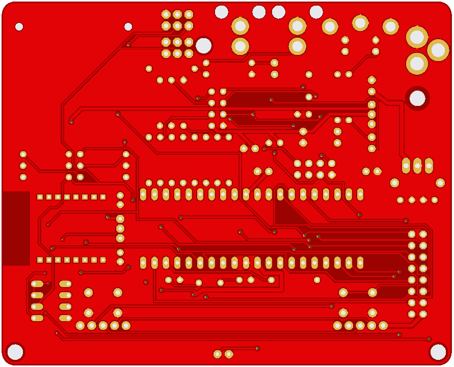

### Schematic and PCB design files for the Uzebox reference design V5.0
  

The Uzebox is a retro-minimalist 8-bit video game console based on only 2 chips.
### Features
* Atmel ATMega644/A/P/PA overclocked at 28Mhz
* NTSC video generation with the AD725 RGB-to-NTSC converter chip
* Composite and S-Video outputs
* SD card interface
* ESP-12E/F Wi-fi module that can be soldered via castlated pads or in a through hole fashion.
* SPI RAM support
* Two SNES controller sockets
* Reset and soft power buttons
* ISP Port
* Extension header

### Revisions
* PCB rev.1.3.3
* Replaced the MIDI interface with Uzenet interface
* Added second ISP footprint for 90 deg connectors
* New footprint for SD card connector (see BOM)

### Assembly guide
* The assembly guide is part of the project [here](Uzebox-V5.0-assembly-guide.md).

### Notes
* Schematic and PCB design files are provided in EAGLE format (.sch, .brd)
* The provided Gerber files can simply be zipped toghether and directly uploaded to PCB manufacturer such as [JLCPCB](https://jlcpcb.com/) and [PCBWay](https://www.pcbway.com/).
* A Digikey shopping list is available to quickly order all parts. The list is continuously maintained as parts goes out of stock. https://www.digikey.ca/en/mylists/list/QP8GNGSW4R

### Links
* [Uzebox website](https://uzebox.org/index.php)
* [Uzebox Forums](https://uzebox.org/forums/)
* [uzebox WIKI](https://uzebox.org/wiki/Main_Page)
