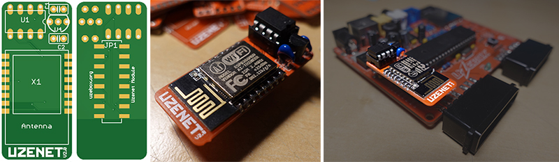

 
The Uzenet module V2.0 allows any Uzebox or compatible equipped with the standard EXT header to connect to a Wi-Fi network. It also includes a SPI RAM module providing an extra 128K to games and applications. Wi-Fi connectivity is accomplished using the common ESP8266 ESP-12E/F module using Espressif's stock firmware. Applications communicates with the ESP-12 module using plain AT commands.

### Notes
* Schematic and PCB design files are provided in EAGLE format 
* The provided Gerber files can simply be zipped toghether and directly uploaded to PCB manufacturer such as [JLCPCB](https://jlcpcb.com/) and [PCBWay](https://www.pcbway.com/).
* It's recommended to upgrade the ESP-12 to the latest version. See the wiki for the [manual update procedure](https://uzebox.org/wiki/ESP8266_Manual_Upgrade). 
* A Digikey shopping list is available to quickly order all parts. The list is continuously maintained as parts goes out of stock. https://www.digikey.ca/en/mylists/list/SRSY6ZW28E

